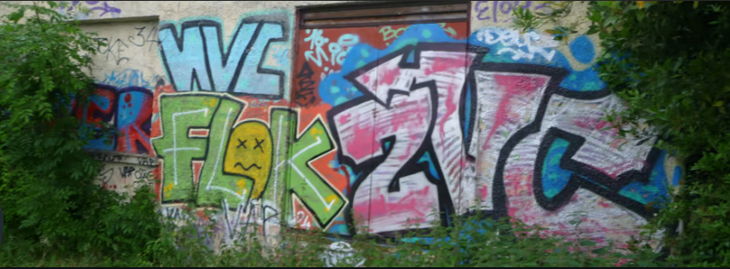

<html lang="fr">
<head>
<meta charset="UTF-8">
<meta name="autor" content="Hilie Saro">
<meta name="description" content="page personnel de hilie saro sur le bodybuilding et le culturisme">
<title>Hilie</title>
<link rel="stylesheet" href="main_style.css">

<!--[if lt IE 9]>
   
<![endif]-->
</head>
<body>
	<header style="background: #ffffff">
		
	</header>
	  
	<nav>
		<ul>
		    <li><a href="news.html">🌞 Actualités 🌞</a></li>
		    <li><a href="contact.html">🌍 Contact 🌍</a></li>
			<li><a href="photos.html">📷 Photos 📸</a></li>
			<li><a href="videos.html">🎥 Vidéos 🎥</a></li>
			</ul>
	</nav>
	
<h1>BODYBUILDING</h1>
  
	<h2> HILIE </h2>
	<aside>
		

			Bienvenue!
		

	</aside>

<footer> 

Droits réservés<a href="mentionslégales.html">Mentions légales</a>

</footer>
</body>
</html>
