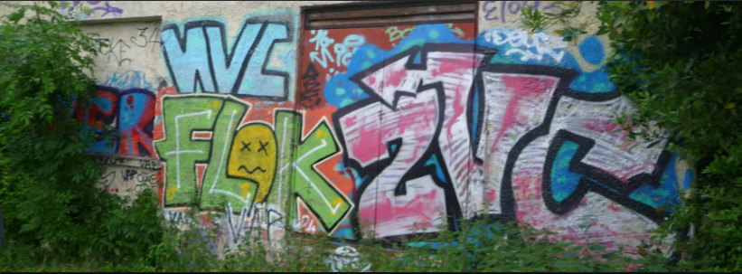

<html lang="fr">
<head>
<meta name="autor" content="Hilie Saro">
<meta name="description" content="page personnel de hilie saro sur le bodybuilding et le culturisme">
<link rel="stylesheet" href="styles/main_style.css">

<!--[if lt IE 9]>
   
<![endif]-->
</head>
<body>
	<header style="background: #ffffff">
		
	</header>
	  
	<nav>
		<ul>
		    <li><a href="news.html">🌞 Actualités 🌞</a></li>
			<li><a HREF="https://opensea.io/collection/hilie">🔗HILIE NFT💎</A></li>
            <li><a HREF="https://opensea.io/collection/hilie-pfp">🔗HILIE pfp💪</A></li>
			<li><a HREF="https://opensea.io/collection/hilie-nft-prestige">🔗NFT PRESTIGE👑</a></li>
		    <li><a href="contact.html">🌍 Contact 🌍</a></li>
			<li><a href="photos.html">📷 Photos 📸</a></li>
			<li><a href="videos.html">🎥 Vidéos 🎥</a></li>
			</ul>
	</nav>
	
<h1>BODYBUILDING</h1>
  
	<h2> HILIE </h2>
	<aside>
		
Bienvenue! Attrappe moi... 
			<button onclick="afficherPosition()">Clique pour connaître tes coordonnées</button> <A HREF="https://www.coordonnees-gps.fr/">💎 vérifie sur la carte de France si tu es
				bien chez toi!</A>
    

    

	</aside>

<footer>

<h3><a href="mentionslégales.html">Droits réservés & Mentions légales</a></h3>

</footer>
</body>
</html>
